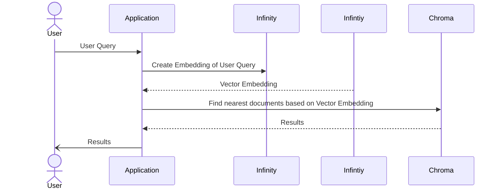

# Vector database lab

For this session we'll be using a vector database called [Chroma](https://docs.trychroma.com/) and a SentenceTransformer for creating embeddings called [Infinity](https://github.com/michaelfeil/infinity).

This setup could be used as the Retrieval step in a [RAG](https://www.promptingguide.ai/techniques/rag). 

Here is a diagram for what we will be building in this lab:



Make sure you've read the [prerequisites](#prerequisites) for this lab.

First, let's get all the parts running. 

## Preparations

1. Infinity
    - To generate the vector embeddings we need a language model and an application that can extract the vector. A very common library for this is called [SentenceTransformer](https://www.sbert.net/) which is implemented in Python. Another way is to use an online service to get the embeddings, for example [OpenAI's API](https://platform.openai.com/docs/guides/embeddings/what-are-embeddings). In this lab we'll use a self-hosted API called [Infinity](https://github.com/michaelfeil/infinity).
    - Start the Infinity API: 
    - ```docker run -it -p 8080:8080 michaelf34/infinity:latest --model-name-or-path sentence-transformers/all-MiniLM-L6-v2 --port 8080```
    - Let's generate a vector embedding! Go to the [Swagger docs for the API](http://0.0.0.0:8080/docs#/default/_embeddings_v1_embeddings_post), click on "Try it out", add a sentence to the "input"-array and press "Execute.
    - 
    - You should get a response with a vector in 384 dimensions. 
1. Chroma
    - Chroma is a lightweight vector database that has a REST API and language bindings for Python and JavaScript. 
    - Start Chroma in Docker:
    - ```docker run -p 8000:8000 chromadb/chroma```
    - Verify it is up an running by viewing the [FastAPI](http://0.0.0.0:8000/docs)

## Lab 1
Let's see how well the language model works and how to add records to Chroma by adding a subset of the [MS MARCO](https://microsoft.github.io/msmarco/) dataset. MS MARCO is is a question answering dataset featuring 100 000 real Bing questions and human generated answers. 

For this exercise we'll use only two of the questions with around 1000 different answers to each question. You can find the file in [/msmarco/msmarco-subset.tsv](/msmarco/msmarco-subset.tsv).

The content is tab-separated with the following columns:
|  qid  |  pid  |  query  | passage |
| :---: | :---: | :------ | :------ |
| 1133167 | 4712273 | how is the weather in jamaica | Jamaica is famous for having gorgeous sunny and warm weather most of the year. That is one of the main reasons that people like to vacation in Jamaica. If you’re making travel plans to visit Jamaica you’re probably trying to find out what the best time of the year is to visit Jamaica so that you can make the most of your vacation. Well, what the best time of year is depends on what you like to do. If you want to sit on a beach with a cold drink and bask in the warm sun for a few days then the best time to plan a trip to Jamaica is during the summer months when the temperature is usually between 80 and 90 degrees every day. |

The two questions we'll be working with are:
- How is the weather in Jamaica?
- Hydrogen is a liquid below what temperature?

Have a look at the dataset and some different answers to these questions. Some are relevant and some are really not even answering the question. 

There is a prepared program that reads the dataset and upserts the data to Chroma. Run:
```node indexMsMarco.mjs```

The upserts of around 2500 lines of data takes around 4 minutes on an Apple M1 Max. While the program is running, have a look at the code in [indexMsMarco.mjs](/indexMsMarco.mjs). 

It starts with:
```JavaScript
const client = new ChromaClient();
const embedder = new SentenceTransformer('key-not-needed');


// Prepare the collection
const collection = await client.getOrCreateCollection({
  name: COLLECTION_NAME,
  embeddingFunction: embedder,
});
```

What is the embedder? It is a function that is called by the ChromaClient to get the vector embedding for the document or query. In our case SentenceTransformer makes an API call to Infinity that we started in the preparations. 

The Chroma API can work with batches and in this example we add 20 documents per batch. 
```JavaScript
await collection.upsert({
        ids: ids,
        metadatas: metadatas,
        documents: documents
      });
```

The vector for each item is based on the contents of the corresponding item in the ```document``` array. Chroma expects a unique ID in string format and has the capability to store metadata as well. This is practical if you want to store extra information about the data. 

Now that the data has been embedded and stored in Chroma, let's try a query.

Run: ```node query.mjs```

It's fairly simple, first get the collection and specify the embedding function. Remember that to find documents that are semantically near the query — the query itself also needs to be embedded. 

```JavaScript
const collection = await client.getCollection({
  name: COLLECTION_MSMARCO,
  embeddingFunction: embedder
});

const results = await collection.query({
  nResults: 10,
  queryTexts: ["What is the weather like in Jamaica?"],
});

console.log(results); 
```

The response contains ```nResults``` number of items ordered by their distance to the query. 
## Prerequisites
- Node >v21.4.0
- Docker for Desktop (or similar)
- IDE, for example Visual Studio Code